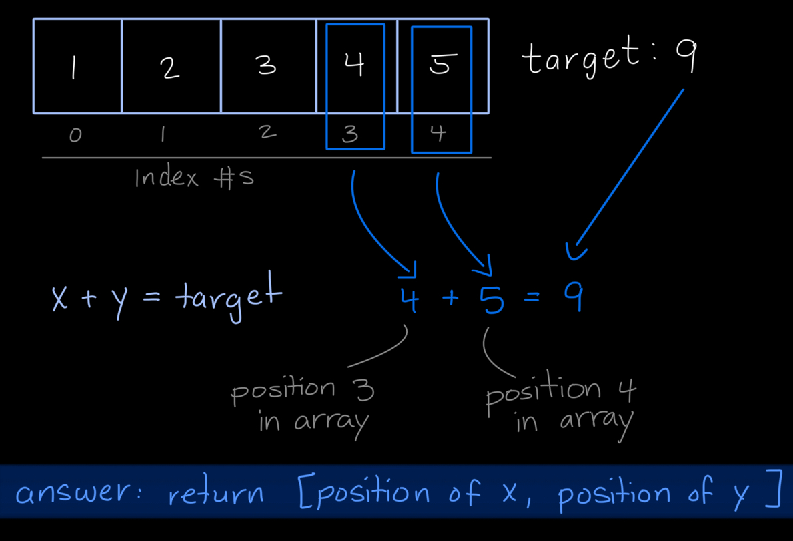
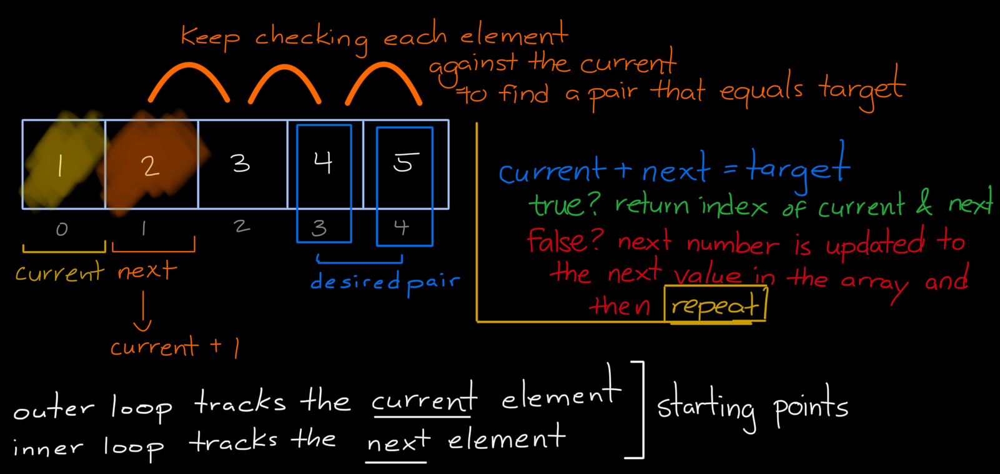
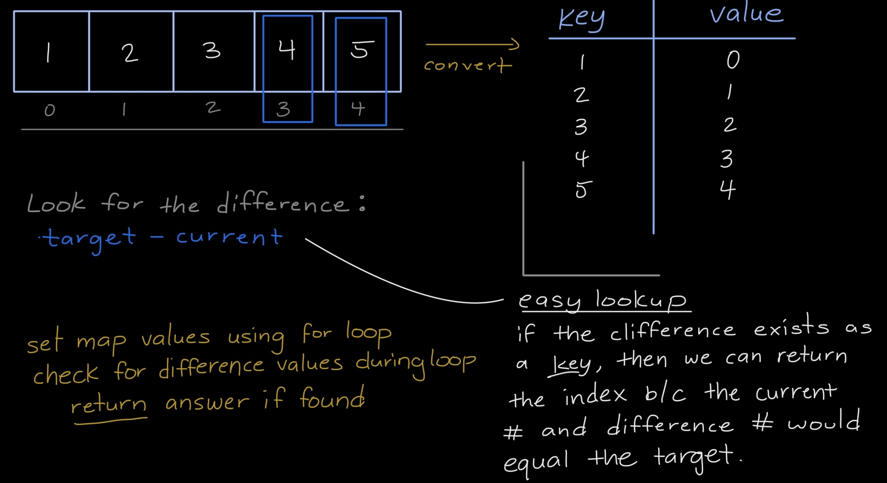

## Explanation: [0001. Two Sum](https://leetcode.com/problems/two-sum/description/)

[](https://leetcode.com/problemset/?difficulty=EASY)
[](./README.md)
[](./solution.js)

### Key Topics

Arrays, Hash Table

### Problem In My Own Words

Based on the given array and the target number, find the positions (indices) of two numbers that equal the target value. Each input should only have one solution and the same numbers can't be used twice.

### Initial Solution

- **Time Complexity**: O(n²) because of the nested `for` loop
- **Issue**: Using the nested `for` loop approach would check every possible pair which would be performance intensive

```js
function twoSum(nums, target) {
	for (let x = 0; x < nums.length; x++) {
		for (let y = x + 1; y < nums.length; y++) {
			if (nums[x] + nums[y] === target) {
				return [x, y];
			}
		}
	}
}
```

### Optimized (Final Solution)

- **Time Complexity**: O(n) as it only uses one `for` loop (one operation) and `Map` lookup processes only cost O(1) time complexity
- **Improvement**: Uses a Hash Map data structure for the easy lookup functions `get()` and `has()` and only requires looping through the original array once.

```js
function twoSum(nums, target) {
	const values = new Map();

	for (let n = 0; n < nums.length; n++) {
		const difference = target - nums[n];

		if (values.has(difference)) {
			return [values.get(difference), n];
		}
		values.set(nums[n], n);
	}
	return [];
}
```

### Process



I originally drew out a visual of the array along with the index numbers for each value. I knew that one array element plus another array element, (x + y), would need to equal the target value. In the example I used, the array is `[1, 2, 3, 4, 5]` and the target value is `9`. Ultimately, whatever algorithm I implement would have to result in `[3, 4]` for this example which would be the position of one array element and another array element that equals the target.

**The original solution**

I originally came up with the idea of using two loops: one outer loop to keep track of a `current` array element, starting with the first element, and an inner loop that would add the `next` array element with the `current` from the outer loop to see if it adds up to the desired target. This inner loop would do so until it found a match and if a match isn't found, the outer loop would move to the next array element for its `current` variable and the inner loop would execute again by iterating through the rest of the array, adding each value to the `current` until the target is found.



For brevity, I use the variables `x` for the outer loop index and `y` for the inner loop index instead of `current` and `next` in the coded solution. The variables `current` and `next` just made sense when drawing it out.

After submitting on Leetcode, I realized it wasn't the most optimal solution even though it worked. Specifically because the solution's time complexity was O(n²) because of the nested for loop. The nested for loop meant that every possible pair would be checked which isn't great for performance.

**The optimized solution**

As shown above, I ended up using the Map data structure. Map data structures allow us to create key-value pairs and have built-in lookup functions that make it quick and efficient to search, check and set values.



The Map approach works by:

1. Converting the array `[1, 2, 3, 4, 5]` into a Map where the array values become keys (1, 2, 3, 4, 5) and the array indices become values (0, 1, 2, 3, 4).
2. For each number in the array, we calculate the difference: `target - current`
   - Example: If target is 9 and current number being iterated over is 4, then the difference would be 5. We would then look for 5 within the Map structure.
3. Check if the difference exists as a key in the Map:
   - If it exists, the pair is found and we can return the current index (from the for loop variable) and the stored index from the Map using `map.get(difference)`
   - If it doesn't exist, add the current key-value pair to the Map structure to aid in future lookup

This approach ends up being more efficient because the Map lookups for `has()` and `get()` are both O(1) operations and we only need to loop through the array values once.

### Test Cases & Findings

```js
// Basic Tests
console.log(twoSum([1, 2, 3, 4, 5], 9)); // [3, 4]
console.log(twoSum([0, 0, 1, 1], 1)); // [1, 2]
console.log(twoSum([7, 10, 3, 2, 6, 0, 9, 11], 21)); // [1, 7]
console.log(twoSum([-3, -3], -6)); // [0, 1]

// Edge Cases
console.log(twoSum([0, 9, 8], 10)); // []
console.log(twoSum([1], 10)); // []
console.log(twoSum([], 10)); // []
```

### What I Learned

- Importance of considering time complexity **before** writing out a code solution
- How Map data structures can optimize lookup operations
- Testing edge cases

### Resources

- [MDN Web Documentation: JavaScript Map](https://developer.mozilla.org/en-US/docs/Web/JavaScript/Reference/Global_Objects/Map)
- [Youtube: AlgoJS's Two Sum Solution](https://youtu.be/lhbhk3dN10Q?si=DA61eJiRE4zfWw1q)
- [Freecodecamp: What is the hash map?](https://www.freecodecamp.org/news/what-is-a-hash-map/)
