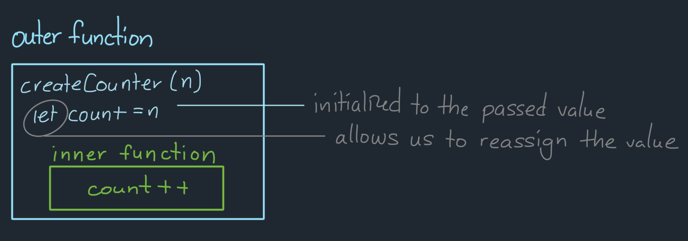
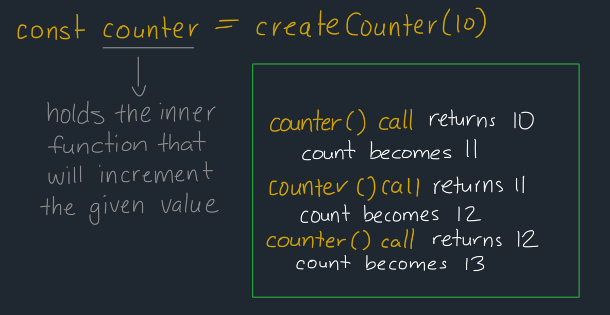

## Explanation: [2620. Counter](https://leetcode.com/problems/counter/description/)

[](https://leetcode.com/problemset/?difficulty=EASY)
[](./README.md)
[](./solution.js)

### Key Topics

Closures, Factory Functions

### Problem In My Own Words

Create a function that returns a counter function that increments the given initial value every time that counter function is called. Every time the counter function is called, the number should be one more than its previous value and shouldn't reset to its initial value.

### Final Solution

- **Time Complexity**: O(1) for each counter function call

```js
function createCounter(n) {
	let count = n;
	return () => count++;
}
```

### Process



**How closure works here**:

The outer function `createCounter(n)` takes the initial value of `n` and initializes the `count` variable to `n`. This allows me to create a starting point for the returned (inner) function to reference when the number needs to be incremented. The inner function would have access to the `count` variable through closure. The inner function returns the current value of count and increments the count for the next `counter()` call.

The use of `let` when assigning the `count` variable is imperative for the inner function to work because it allows the inner function to reassign the value.



In order to use and test the `createCounter(n)` function:

1. We can create a counter by calling the `createCounter(10)` function - with `10` as the initial value.
2. The returned function that does the `count` incrementing is stored in the `const counter` variable.
3. Each `counter()` call will return the current value and then increment it.

**Difference between pre-increment and post-increment**

- `count++` returns the value and then, increments the value
- `++count` increments the value, and then returns the value

### Test Cases & Findings

```js
const counter = createCounter(10);
counter(); // 10 - initial value
counter(); // 11 - incremented once
counter(); // 12 - incremented twice

/* Note: Additional counters can be created and they would have their own count variable */
const secondCounter = createCounter(151);
secoundCunter(); // 151 - inital value
secondCcounter(); // 152 - incremented once
secondCcounter(); // 153 - incremented twice

counter(); // 13 - incremented thrice
```

### What I Learned

- How closures maintain state
- Difference between post-increment `count++` and pre-increment (`++count`)
- How factory functions work
- Function scope

### Resources

- [MDN: Factory Functions](https://developer.mozilla.org/en-US/docs/Web/JavaScript/Reference/Functions)
- [Digital Ocean: Understanding Closures](https://www.digitalocean.com/community/tutorials/js-closures)
