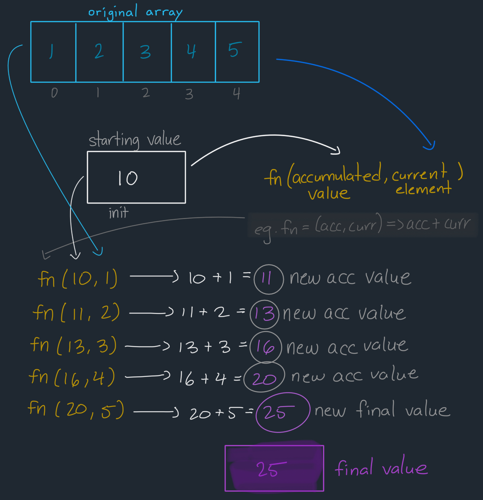

## Explanation: [2626. Array Reduce Transformation](https://leetcode.com/problems/array-reduce-transformation/description/)

[](https://leetcode.com/problemset/?difficulty=EASY)
[](./README.md)
[](./solution.js)

### Key Topics

Arrays, Higher-Order Functions

### Problem In My Own Words

Create a function that processes an array one element at a time, with the following criteria:

- Starts with an initial value `init`
- Takes a function `fn` that:
  - Accepts two parameters, the previous value and the current element's value
  - Returns a new value
- For each array element:
  - Uses the `fn` function to combine the previous result with the current element
  - Stores the result for the next operation (which would use this result as the previous result for the next 'current' element)
- Finally, the main function that takes the `nums` array, `fn` function and `init` value will return the final accumulated value

### Final Solution

- **Time Complexity**: O(n) where `n` is the length of the array that is passed. Because each element in the array will be iterated through, the time complexity is dependent on the number of items.

```js
const reduce = function (nums, fn, init) {
	let current = init;

	for (let i = 0; i < nums.length; i++) {
		current = fn(current, nums[i]);
	}

	return current;
};
```

### Process

The `reduce` function:

- `current` starts with the `init` value and is declared using `let` to allow reassignment to a new value.
- Each iteration in the `for` loop will update `current` by passing the previously saved result inside `current` along with the current array element `nums[i]` to the function that will consolidate these values.
- The final value of `current` is reassigned to whatever the reducer function returns.



### Test Cases

Based on the below example:

- We have an array `[1, 2, 3, 4]`
- We have a reducer function where the result we're looking for is the `accumulatedValue` variable and the `element` value represents the current array element
- We have an initial start value of `10` for the `accumulatedValue`

If we apply the `reduce` using this information, the following will happen:

1. At index 0, for the value of `1`: `current = fn(10, 1) = 11`
2. At index 1, for the value of `2`: `current = fn(11, 2) = 13`
3. At index 2, for the value of `3`: `current = fn(12, 3) = 16`
4. At index 3, for the value of `4`: `current = fn(15, 4) = 20`
5. At index 4, for the value of `5`: `current = fn(20, 5) = 25`

```js
// Basic reducing
reduce([1, 2, 3, 4, 5], (accumulatedValue, element => accumulatedValue + element), 10); // 25
```

### Resources

- [MDN Web Documentation: Array.prototype.reduce()](https://developer.mozilla.org/en-US/docs/Web/JavaScript/Reference/Global_Objects/Array/reduce)
