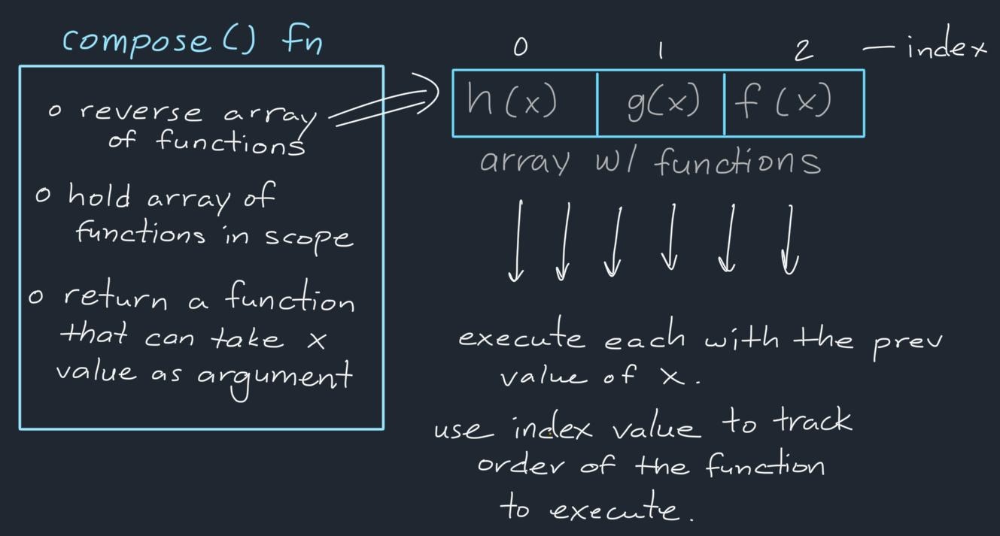
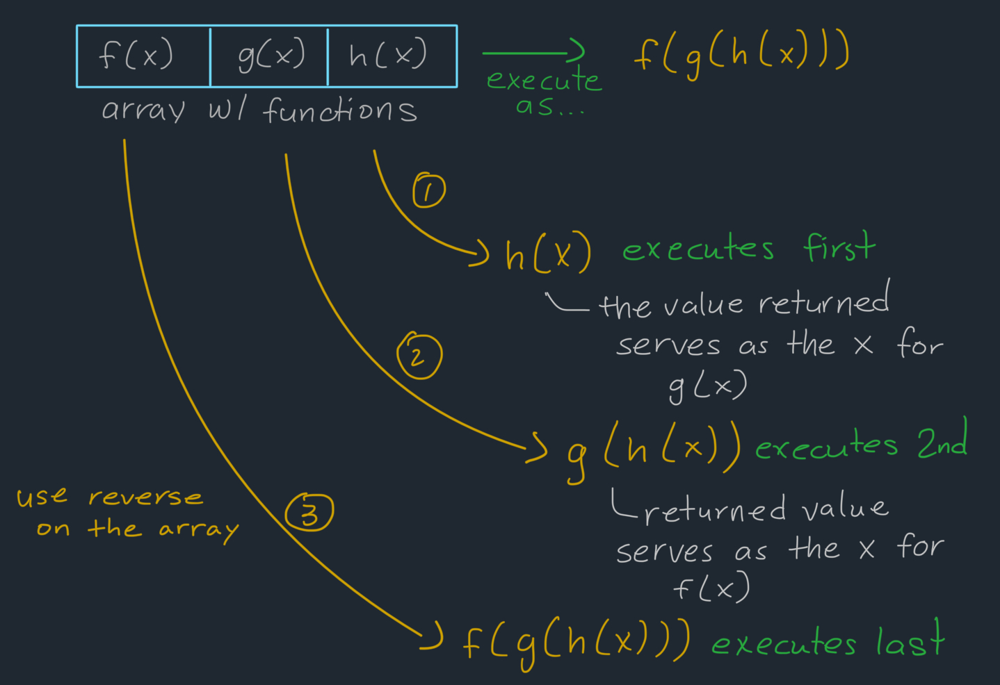

## Explanation: [2629. Function Composition](https://leetcode.com/problems/function-composition/description/)

[](https://leetcode.com/problemset/?difficulty=EASY)
[](./README.md)
[](./solution.js)

### Key Topics

Array Reverse, Function Composition, Higher-Order Functions

### Problem In My Own Words

Create a function that takes an array of functions as an argument `[f(x), g(x), h(x), ...]` and returns a function that:

- takes an input value of `x` (a single integer)
- processes this value through each function in reverse order
- returns the final result (a single integer)
- results in `x` if an empty array of functions is passed into the outer function

### Final Solution

**Time Complexity**: O(n) to reverse the array; O(n) for each function

```js
function compose(functions) {
	functions.reverse();

	return function (x) {
		let result = x;
		for (let i = 0; i < functions.length; i++) {
			result = functions[i](result);
		}
		return result;
	};
}
```

### Process

**Initial setup of the `compose` function**



For the outer function called `compose`, there are three main responsibilities to fulfill:

- reverse the array of functions to match the execution order
- holds the array of function in scope through closure
- returns a function that can accept an input value of `x`

The returned inner function is anonymous since it will be named through the variable it's assigned to (e.g., `const fn = compose([])` assigns the returned function to the name `fn`).

**How the inner function executes the array of functions**



When the returned function is called with a value of `x`:

- `h(x)` executes first with `x`
- `g(x)` executes next with the result of `h(x)`
- `f(x)` executes next with the result of `g(h(x))`

### Test Cases & Findings

```js
const fn = compose([x => x + 1, x => 2 * x]);
fn(4); // (2 * 4) = 8, then (8 + 1) = 9 -- final answer is 9
```

### What I Learned

- How function composition works in JavaScript
- How closure maintains access to the array of functions
- How to process an array of functions through a loop

### Resources

- [Unlocking the Power of Function Composition: JavaScript Made Easy](https://dev.to/chintanonweb/unlocking-the-power-of-function-composition-javascript-made-easy-4g59)
