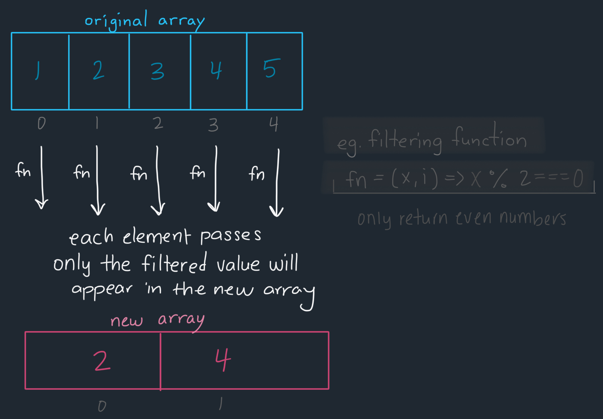

## Explanation: [2634. Filter Elements From Array](https://leetcode.com/problems/filter-elements-from-array/description/)

[](https://leetcode.com/problemset/?difficulty=EASY)
[](./README.md)
[](./solution.js)

### Key Topics

Arrays, Higher-Order Functions

### Problem In My Own Words

Create a function that takes an array and a filtering function and retuns a filtered array. The returned filtered array should only returns elements of the array that pass the filtering function (by evaluating to a truthy value). The filtering function should take the current element's value `arr[i]` and the index number `i` (optional) so that `fn(arr[i], i)`. It should be solved without using the `Array.filter` method.

### Final Solution

- **Time Complexity**: O(n) where `n` is the length of the array that is passed. Because each element in the array will be iterated through, the time complexity is dependent on the number of items.

```js
const filter = function (arr, fn) {
	const filteredArray = [];

	for (let i = 0; i < arr.length; i++) {
		if (fn(arr[i], i)) {
			filteredArray.push(arr[i]);
		}
	}

	return filteredArray;
};
```

### Process

The `filter` function filters an array by:

1. Creating an empty array to store the new values (only elements that pass the filtering check).
2. Iterating through each element of the original array.
3. Applying the filtering function to each element.
4. If the filtering function returns a truthy value, then the element will be stored in the new array. If it does not return a truthy value (evaluating to false, undefined or null value), then the element will be ignored and not "pushed" into the new array.



For example, if we start with the array `[1, 2, 3, 4, 5]` and use the function `fn = (x) => x % 2 === 0` to check if each element is even or odd, we would end up with the following outcomes:

- At index 0, the value `1`: `1 % 2 === 0` would evaluate to false. The filtered array would be `[]` (unchanged).
- At index 1, the value `2`: `2 % 2 === 0` would evaluate to true. The filtered array would be `[2]`.
- At index 2, the value `3`: `3 % 2 === 0` would evaluate to false. The filtered array would be `[2]` (unchanged).
- At index 3, the value `4`: `4 % 2 === 0` would evaluate to true. The filtered array would be `[2, 4]`.
- At index 4, the value `5`: `5 % 2 === 0` would evaluate to false. The filtered array would be `[2, 4]` (unchanged).

The original array remains untouched, and we receive a new array `[2, 4]` representing only the even numbers from the original array.

### Test Cases

```js
// Basic filtering
filter([1, 2, 3, 4, 5], x => x % 2 === 0); // [2, 4]

// Filtering using the index number
filter([10, 20, 30], (x, i) => i < 2); // [10, 20]
```

### Resources

- [MDN Web Documentation: Array.prototype.filter()](https://developer.mozilla.org/en-US/docs/Web/JavaScript/Reference/Global_Objects/Array/filter)
