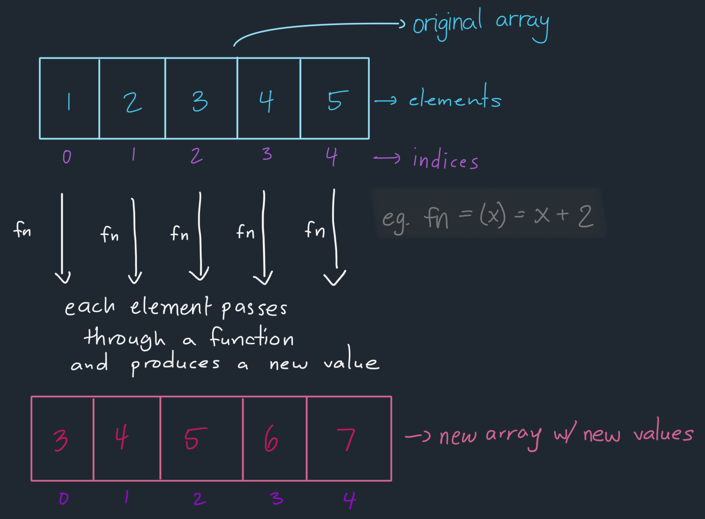

## Explanation: [2635. Apply Transform Over Each Element In Array](https://leetcode.com/problems/apply-transform-over-each-element-in-array/description/)

[](https://leetcode.com/problemset/?difficulty=EASY)
[](./README.md)
[](./solution.js)

### Key Topics

Arrays, Higher-Order Functions

### Problem In My Own Words

Create a function that takes an array and a function where the function would be applied to every single element of the array and a new array would be returned with the new values. It should be solved without the `Array.map` method and should pass the current element's value `arr[i]` and index number `i` to the transformation function (`returnedArray[i] = fn(arr[i], i)`).

### Final Solution

- **Time Complexity**: O(n) where `n` is the length of the array that is passed. Because each element in the array will be iterated through, the time complexity is dependent on the number of items.

```js
const map = function (arr, fn) {
	const newArray = [];

	for (let i = 0; i < arr.length; i++) {
		const newValue = fn(arr[i], i);
		newArray.push(newValue);
	}

	return newArray;
};
```

### Process

The `map` function transforms an array by:

1. Creating an empty array to store the new values.
2. Iterating through each element of the original array.
3. Applying a function to each element.
4. Storing the transformed values in the new array.



For example, if we start with the array `[1, 2, 3, 4, 5]` and pass the function `fn = (x) => x + 2`, the map function will:

- Loop through each element
- Apply the function to transform each value
- Store each new value in a new array

The original array remains untouched, and we receive a new array `[3, 4, 5, 6, 7]`.

### Test Cases

```js
// Basic transformation
map([1, 2, 3, 4, 5], x => x + 2); // [3, 4, 5, 6, 7]

// Transformation using the index number
map([10, 20, 30], (x, i) => x + i); // [10, 21, 32]
```

### Resources

- [MDN Web Documentation: Array.prototype.map()](https://developer.mozilla.org/en-US/docs/Web/JavaScript/Reference/Global_Objects/Array/map)
